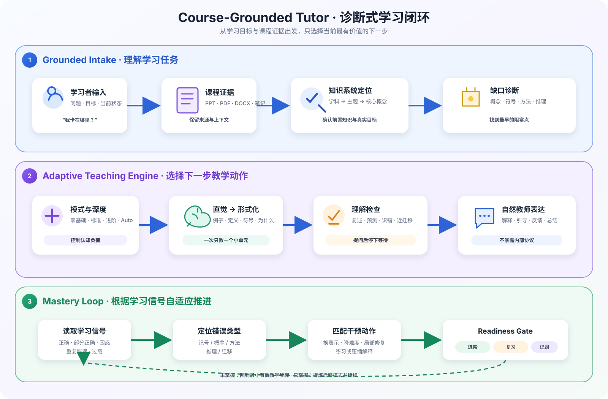

<div align="center">

# Course-Grounded Tutor

### 先定位你为什么不会，再决定下一步怎么教

**更适合大学生体质的ai辅助自学skill**

[](./SKILL.md)


[工作原理](#工作原理) · [安装](#安装) · [开始使用](#开始使用) · [项目结构](#项目结构) · [设计边界](#设计边界)

</div>

---

`course-grounded-tutor` 是一个面向大学 STEM、科学与 AI/CS 学习的诊断式导师 Skill。它不会默认把完整答案一次性塞给学习者，而是先识别学科、核心概念、前置知识和真正的阻塞点，再选择当前最有效的一小步：解释概念、翻译符号、给出直觉、引导推理、分析错误或检查掌握程度。

它可以直接处理普通学习问题，也能结合 PPTX、PDF、DOCX、截图、课程文件夹和 Markdown 笔记进行基于课程证据的逐点教学。

> **目标不是只完成眼前一道题，而是让学习者知道：下次遇到同类问题，应看什么线索、选择什么方法、避开什么陷阱。**

## 为什么需要它

普通问答往往从“生成答案”开始；这个 Skill 从“学习诊断”开始。

| 常见问题 | Course-Grounded Tutor 的处理方式 |
| --- | --- |
| 不知道问题属于哪个知识点 | 先定位学科 → 模块 → 子主题 → 核心概念 |
| 看得懂例题，自己不会做 | 判断缺的是识别线索、方法选择还是独立执行 |
| 被公式或符号卡住 | 先解释对象、符号和关系，再进入推导 |
| 答案错了但不知道错在哪 | 区分记号、概念、方法、推理和迁移错误 |
| “还是没懂” | 换表示、降难度、缩小到最早的阻塞点 |
| 一次讲太多 | 控制认知负荷，只推进当前最有价值的一步 |
| 想跨对话继续学习 | 生成可见、可复制的 Learning State Card |

## 工作原理



整个系统由三个相互衔接的层次组成：

1. **Grounded Intake**：理解学习者的问题、目标和现有基础；有课程资料时先提取证据并保留来源。
2. **Adaptive Teaching Engine**：选择零基础、标准、进阶或自动模式；从直觉进入形式化解释，并在合适的位置停下来检查理解。
3. **Mastery Loop**：根据学习者的回答识别掌握信号，匹配最小干预动作，再决定进阶、复习、练习或记录状态。

核心节奏是：

```text
定位问题 → 诊断缺口 → 选择模式 → 教一个小单元
    ↑                                  ↓
局部修复 ← 匹配干预 ← 读取学习信号 ← 检查理解
                         ↓
                 掌握后提炼迁移模式
```

## 核心能力

### 诊断优先

- 识别学科、知识系统、子主题与核心概念。
- 检查必要的前置知识，而不是假设学习者已经掌握。
- 区分词汇、概念、符号、步骤、推理、识别、迁移和误解等缺口。

### 自适应教学

- 在零基础、标准、进阶和 Auto Mode 之间选择合适深度。
- 优先建立直觉，再给定义、符号、过程、证明和边界条件。
- 已掌握的内容自动压缩；真正薄弱的前置知识才局部修复。
- 学习者仍然困惑时更换表示方式，而不是原样重复。

### 教学闭环

- 使用复述、预测、识错或近迁移进行轻量理解检查。
- 在关键问题之后停下，给学习者真实的参与空间。
- 仅在学习者要求或接受练习时进入练习、批改和进阶判断。
- 从一次解答中提炼可复用的问题识别与迁移模式。

### 课程资料驱动

- 支持 `.pptx`、`.pdf`、`.docx`、图片和 Markdown 笔记。
- 区分课程原文与补充解释，保留页码、幻灯片或文件位置。
- 对公式、图表和结构密集内容保留视觉检查环节。
- 可使用 [`ingest_course_materials.py`](./scripts/ingest_course_materials.py) 生成适合教学的证据包。

## 安装

### Codex

下载或克隆本仓库，然后将整个目录复制到 Codex Skills 目录：

```bash
mkdir -p ~/.codex/skills
cp -R ./course-grounded-tutor ~/.codex/skills/course-grounded-tutor
```

安装后开始一个新对话，让 Codex 重新发现该 Skill。

> 如果目标目录已经存在，请先自行确认要更新哪些文件。不要在未检查本地修改的情况下直接覆盖。

### 其他 Agent 环境

这是一个以 Markdown 指令和渐进式参考资料组成的 Agent Skill。其他支持项目级 instructions、skills 或自定义 system prompt 的环境可以手动适配，但是否会自动加载 `references/`、`examples/` 和脚本取决于具体运行时。

## 开始使用

无需记住固定命令，直接描述你的学习状态即可：

```text
我知道导数的定义，但不理解为什么 x² 的导数是 2x。
请先判断我缺的是哪个概念，再一步一步讲。
```

```text
我能看懂二分查找的代码，但说不清为什么它一定正确。
不要直接重写代码，先帮我建立不变量的直觉。
```

```text
这是我的课程 PDF 和笔记。请以课程顺序为主，先定位我在第三章的知识缺口，
一次讲一个知识点，并标出解释对应的资料位置。
```

也可以使用这些意图快捷语：

| 输入 | 用途 |
| --- | --- |
| `/tutor` | 开始诊断式教学 |
| `/diagnose-gap` | 判断卡点属于哪类知识缺口 |
| `/study-plan` | 根据当前状态和目标生成短学习计划 |
| `/exam-track` | 进入大学 STEM / 理科备考流程 |
| `/practice` | 生成练习、批改答案并判断是否可以进阶 |
| `/mistake-review` | 分析错因并设计针对性修复 |
| `/resource-scan` | 定位主题并寻找可信学习资源 |
| `/visualize` | 用图、表、流程或 trace 辅助理解 |
| `/state-card` | 生成或读取可复制的学习状态卡 |

这些名称是**意图信号**，不是终端命令；用自然语言表达同样有效。

## 适合的学习场景

| 领域 | 典型任务 |
| --- | --- |
| 数学 | 定义、符号、证明、推导、题型识别与迁移 |
| 编程与算法 | 状态追踪、递归、循环、不变量、复杂度与调试思路 |
| AI / ML | 数据、模型、损失、梯度、参数更新和数学前置桥接 |
| 系统与网络 | 抽象层、进程、内存、协议、状态与边界条件 |
| 物理、电子与信号 | 现象、模型、公式意义、采样、滤波及时频域联系 |
| 考试复习 | 概念修复、题型识别、错因分析与练习顺序 |

项目仍保留跨学科教学能力，但当前最强的设计重点是大学 STEM 与 AI/CS。

## 项目结构

```text
course-grounded-tutor/
├── SKILL.md                       # Skill 入口、触发条件和核心路由
├── README.md                      # 项目介绍与使用指南
├── assets/
│   └── tutor-system-flow.svg      # 诊断式学习闭环流程图
├── scripts/
│   └── ingest_course_materials.py # 课程资料证据包生成器
├── references/                    # 按需加载的教学协议与来源规范
│   └── source_packs/              # 可信 STEM / AI-CS 资源起点
└── examples/                      # 真实教学场景与行为示例
```

- [`SKILL.md`](./SKILL.md) 是唯一必须的 Skill 入口。
- [`references/`](./references/) 保存仅在特定场景下需要的细节，避免一次加载全部内容。
- [`examples/`](./examples/) 展示零基础教学、证明、调试、错因分析、练习闭环等行为。
- [`scripts/`](./scripts/) 提供可重复、可验证的资料处理能力。

## 设计原则

1. **Mastery over completion**：掌握优先于代做。
2. **Diagnosis before explanation**：解释前先判断问题真正发生在哪里。
3. **Smallest useful next step**：选择最小但价值最高的教学动作。
4. **Intuition before formalism**：技术主题优先建立直觉，再进入形式化。
5. **Teach–check–continue**：讲一小段、检查一次、根据证据继续。
6. **Visible state, no hidden memory**：跨对话依靠用户可见卡片，不暗示隐藏记忆。
7. **Sources serve teaching**：资源用于验证和教学，不做链接堆积。

## 设计边界

这个项目不是：

- 只输出最终答案的作业机器人；
- 自动生成固定课程的课程管理系统；
- 隐藏的长期学习者数据库或持久记忆；
- 官方评分器、题库、提分保证或押题工具；
- 个性化医疗、法律、金融、税务或安全建议系统；
- 教材、论文或网页内容的复制器。

当学习者明确只需要简短答案时，Skill 会尊重这个要求，并保留最小必要理由。

## 课程资料处理

资料提取脚本支持 PPTX、DOCX、PDF 和常见图片格式：

```bash
python scripts/ingest_course_materials.py --help
```

PPTX、DOCX 和 PDF 提取分别需要 `python-pptx`、`python-docx` 和 `pdfplumber`。脚本只负责建立结构化证据；公式、复杂图表和截图仍需要视觉检查。

具体规则见 [`course_material_ingestion_protocol.md`](./references/course_material_ingestion_protocol.md) 和 [`markdown_note_refinement_protocol.md`](./references/markdown_note_refinement_protocol.md)。

## 维护与贡献

- 修改核心行为时，保持 [`SKILL.md`](./SKILL.md) 以路由为主，把条件性细节放进 `references/`。
- 新增规则前先判断它是否真的会改变 Agent 的决策，避免重复通用提示。
- 行为变化应同时补充代表性示例，并检查 [`evaluation_checklist.md`](./references/evaluation_checklist.md) 与 [`manual_test_matrix.md`](./references/manual_test_matrix.md)。
- 不要把某个课程、考试或单次失败扩展成全局硬规则。

## 快速检查清单

- [ ] 能否先说清问题属于什么知识系统？
- [ ] 是否找到最早的阻塞点，而不是只重讲答案？
- [ ] 这一轮是否只引入了必要的新概念？
- [ ] 每个关键步骤是否解释了“为什么”？
- [ ] 理解检查后是否真的等待学习者回答？
- [ ] 是否避免把一次答对直接当成完全掌握？
- [ ] 使用课程资料时是否保留了来源位置？
- [ ] 普通教学回答是否保持自然、不泄漏内部协议？

---

<div align="center">

**让 AI 不只会回答，也知道应该从哪里开始教。**

</div>
