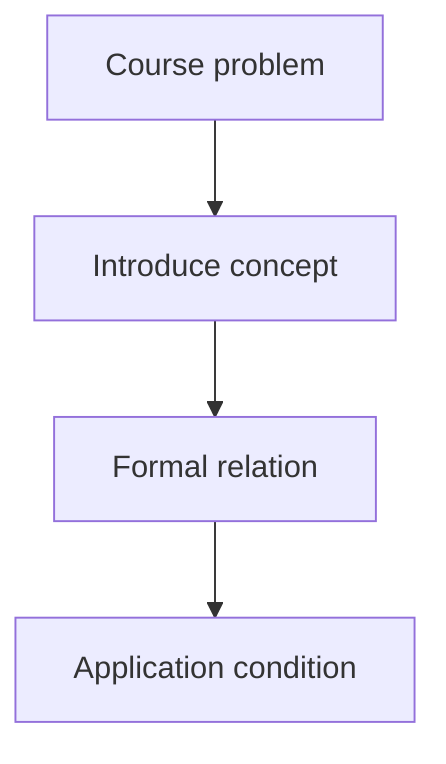

# Markdown Note Refinement Protocol

Use this protocol when the learner uploads or points to a Markdown note and
wants it corrected, supplemented, reorganized, or aligned with the course
materials and the teaching discussion from the current conversation.

## Contents

- [Inputs](#inputs)
- [Workflow](#workflow)
- [Visual Additions](#visual-additions)
  - [Flowcharts and concept diagrams](#flowcharts-and-concept-diagrams)
  - [PPT images](#ppt-images)
- [Correction Rules](#correction-rules)
- [Recommended Note Shape](#recommended-note-shape)

## Inputs

Use three evidence lanes and keep them distinct:

1. **Course framework:** the material bundle and visually verified source
   pages. Treat this as the organizing backbone.
2. **Current conversation:** explanations, examples, distinctions, and
   conclusions developed with the learner in this chat.
3. **Tutor supplement:** useful background added by the tutor. Mark it as
   supplemental when it is not directly established by the course materials.

Do not claim access to chats that are not present in the current context. When
continuing in another chat, require a visible Learning State Card, discussion
summary, or exported transcript.

## Workflow

1. Read the complete Markdown file before editing it.
2. Identify its existing heading hierarchy, terminology, notation, source
   references, examples, unresolved questions, and likely factual errors.
3. Compare it with the course framework and the current conversation.
4. Classify proposed changes:
   - correction of a factual, mathematical, or logical error;
   - clarification of an ambiguous sentence;
   - missing prerequisite or definition;
   - missing connection between two course points;
   - improved derivation, example, diagram explanation, or boundary condition;
   - structural reorganization;
   - explanatory flowchart or concept diagram;
   - selected PPT image with local source context;
   - optional supplemental material.
5. Preserve the learner's useful wording, examples, and personal memory cues.
   Rewrite only where accuracy, clarity, or structure benefits.
6. Keep the note inside the course's conceptual frame. Do not turn a focused
   chapter note into an unrelated encyclopedia article.
7. Preserve valid Markdown, code fences, tables, links, and math notation.
8. Add a flowchart or PPT image only when it materially reduces explanation
   difficulty. Place it beside the concept it explains, not in an unrelated
   image appendix.
9. Unless the learner explicitly asks to overwrite, preserve the original and
   create a clearly named revised Markdown file such as
   `<original-stem>_refined.md`.
10. Return a compact change summary with corrections, additions, reorganized
   sections, remaining uncertainties, and any source locations used.

## Visual Additions

### Flowcharts and concept diagrams

- Prefer Mermaid inside Markdown for causal chains, procedures, branches,
  feedback loops, state transitions, system blocks, and concept dependencies.
- Use the smallest diagram that clarifies the point. Do not diagram ordinary
  prose, a single fact, or a relationship already clear in one sentence.
- Derive node labels and edges from verified course content and the current
  discussion. Mark tutor-inferred relationships as supplemental when needed.
- Keep labels short, preserve the course's terminology, and explain below the
  diagram what the reader should notice.
- If the target Markdown renderer does not support Mermaid, use a compact
  text flow, table, or a rendered image only when the learner requests it.

Example:



### PPT images

- Select only diagrams, plots, system blocks, tables, formula derivations, or
  worked examples whose visual structure is important to understanding.
- Exclude logos, decorative backgrounds, repeated images, unreadable crops,
  and ordinary text that the note already represents more clearly.
- Visually inspect each selected image before embedding it. Do not rely only
  on its filename or neighboring extracted text.
- Copy selected images into a sibling asset folder such as
  `<original-stem>_refined_assets/` so the refined note remains portable. Do
  not link to a temporary extraction directory.
- Use relative Markdown paths and meaningful alt text:

```markdown

```

- Immediately explain the image's axes, arrows, modules, curves, variables,
  or conclusion. A pasted image without interpretation is not an improvement.
- Add a concise source caption such as `来源：control-system.pptx，第18张幻灯片`.
- If only a full-slide image is available, crop or render only the relevant
  region when feasible; otherwise embed the slide and state exactly what the
  learner should inspect.
- Preserve uncertainty when an image or formula is unreadable. Never repair an
  unclear source by inventing missing visual content.

## Correction Rules

- Never silently replace a disputed or uncertain claim with an invented fact.
- Explain material corrections in the change summary.
- Preserve original source citations and add locations when the material
  bundle supports a correction.
- If course material conflicts with a generally accepted account, describe the
  conflict instead of silently forcing one version.
- Do not infer mastery from polished notes. Notes record understanding; they do
  not prove independent application.
- Do not automatically append exercises, quizzes, scores, or answer keys to the
  refined note. Add them only when the learner explicitly chooses practice.
- Do not add decorative diagrams or images merely to make the note look rich.
- Do not embed every extracted PPT image; selection must be tied to a named
  learning purpose.

## Recommended Note Shape

Adapt to the learner's existing structure; do not impose this mechanically.

```markdown
# Chapter or topic

## Position in the course framework
## Point 1: motivation and core idea
### Definition or mechanism
### Discussion-derived understanding
### Formula, diagram, or example
### Visual explanation
### Conditions and common misunderstanding
## Point 2: ...
## Connections between points
## Supplemental explanation
## Remaining questions
## Source locations
```

Use callouts or explicit labels such as `补充理解`, `纠正`, or `仍需确认` only
when they materially help the learner distinguish evidence and uncertainty.
